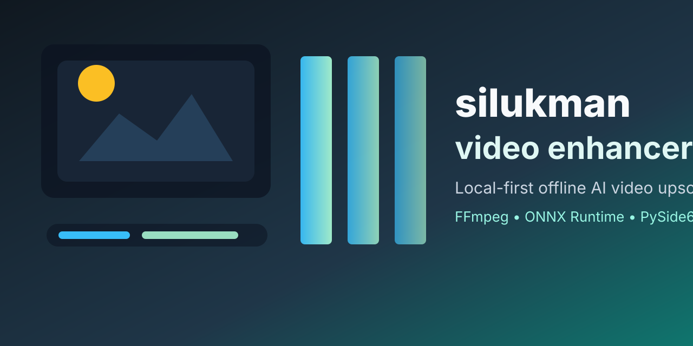

# silukman_video_enhancer



[](#roadmap)
[](LICENSE)
[](https://github.com/lukman-ss/silukman_video_enhancer/releases)
[](https://github.com/lukman-ss/silukman_video_enhancer/releases)
[](#prerequisites)
[](https://github.com/lukman-ss/silukman_video_enhancer/pkgs)

`silukman_video_enhancer` is a local-first, offline video enhancement application designed to run entirely on your own machine. It improves video quality without sending data to the cloud, utilizing hardware-accelerated AI models locally.

This project is a video-focused evolution of [silukman_image_enhancer](https://github.com/lukman-ss/silukman_image_enhancer).

Repository social preview asset: [docs/assets/github-social-preview.svg](docs/assets/github-social-preview.svg).

---

## Key Features

*   **Offline Video Upscaling**: Increase video resolution (e.g., 720p to 1080p, 1080p to 4K) using local neural networks.
*   **Denoising & Deblurring**: Remove camera noise, low-light grain, and light motion blurs.
*   **Compression Artifact Cleanup**: Clean up pixelation and blocky artifacts caused by aggressive video compression.
*   **Color Correction**: Simple automatic adjustments to restore vibrance, contrast, and color balance.
*   **Audio Preservation**: Automatically extracts, syncs, and merges the original audio back into the enhanced video.
*   **Hardware Acceleration**: Built on ONNX Runtime, leveraging local GPU/NPU acceleration (NVIDIA CUDA, Apple CoreML, Windows DirectML) where available.
*   **CLI Workflow**: Optimized command-line interface for batch processing and integration into automation scripts.
*   **Python Desktop UI**: Planned cross-platform desktop interface using a Python GUI stack so the CLI, pipeline, inference, and UI layers can share one language/runtime.

---

## Technical Architecture (Simplified)

```
[Input Video] ──> [FFmpeg Frame Extraction] ──> [Frame Queue]
                                                      │
                                                      ▼
[Output Video] <── [FFmpeg Muxing + Audio] <── [ONNX Inference Engine]
```

---

## Prerequisites

To run this application locally, you will need:

1.  **Python 3.9+**
2.  **FFmpeg** installed and added to your system's PATH (if missing, the application will automatically download static binaries to a local `bin/` folder on first run).
3.  **Hardware Accelerator Drivers** (optional but highly recommended):
    *   NVIDIA CUDA Toolkit (for NVIDIA GPUs)
    *   DirectML (supported out-of-the-box on Windows)
    *   CoreML (supported out-of-the-box on macOS)
4.  **Desktop UI Toolkit** (planned): PySide6/Qt for the Python desktop application.

---

## Installation

```bash
# Clone the repository
git clone https://github.com/lukman-ss/silukman_video_enhancer.git
cd silukman_video_enhancer

# Set up virtual environment
python3 -m venv .venv
source .venv/bin/activate  # On Windows use: .venv\Scripts\activate

# Upgrade pip (required for pyproject.toml editable installs)
pip install --upgrade pip

# Option 1: Install directly from PyPI (recommended)
pip install silukman-video-enhancer

# Option 2: Install in development/editable mode from source
pip install --no-compile -r requirements.txt -e ".[onnx,dev]"

# Option 3: Install a wheel downloaded from the tagged GitHub Release assets
pip install silukman_video_enhancer-*.whl
```

---

## Usage

```bash
# Basic enhancement (upscaling)
python -m app enhance -i input.mp4 --scale 2 --output output.mp4

# Run denoise and color correction
python -m app enhance -i input.mp4 --denoise --color-correct --output output.mp4

# Launch the Python desktop app
python -m app desktop
# or
python -m ui.desktop
```

---

## Project Status & Roadmap

This project is currently in active implementation. Phase 1 through Phase 10 are documented as completed.

- [x] **Phase 1 (MVP)**: Core video pipeline with frame-by-frame extraction, ONNX scaling model integration, and CLI support.
- [x] **Phase 2 (Refinement)**: Temporal consistency checks, advanced noise/blur removal models, and batch CLI processing.
- [x] **Phase 3 (Desktop UI)**: Python desktop interface with PySide6/Qt, side-by-side preview, and offline packaging.
- [x] **Phase 4 (Production)**: Release QA, job control, render farm hardening, subtitle engines, INT8, and timeline preview.
- [x] **Phase 5 (Advanced Media & Runtime)**: Vulkan/WebGPU, OpenVINO/QNN, HDR/LUT workflows, tone mapping, professional codecs, hardware encoder profiling, high-resolution render planning, and model toolchain improvements.
- [x] **Phase 6 (Headless API & Operations)**: REST API, client tooling, access controls, durable queues, worker pools, retries, graceful shutdown, LAN discovery, service diagnostics, log streaming, disk quotas, observability, and containerized render nodes.
- [x] **Phase 7 (Ecosystem Governance & Lifecycle)**: Plugin SDK, sandboxing, workflow automation, reproducible manifests, configuration migration, audit logs, compatibility matrix tests, signed updates, model quarantine, telemetry, maintenance, and SDK docs.
- [x] **Phase 8 (Desktop UX & Batch Processing)**: Multi-file queueing, batch progress, cancellation, retry, recent files, ETA, post-job actions, queue reordering, and output format selection.
- [x] **Phase 9 (CI/CD & Cross-Platform Release Workflow)**: GitHub Actions test matrix, version tagging, signed Windows/macOS/Linux release artifacts, draft releases, smoke tests, and dependency caching.
- [x] **Phase 10 (GitHub Repository Presence)**: Repository metadata, social preview asset, release badges, release/package publication workflows, issue templates, release naming policy, and security disclosure policy.

## GitHub Repository Setup

Repository metadata is documented in [.github/repository.yml](.github/repository.yml). Apply the same values in GitHub repository settings:

* Description: `Local-first offline video enhancement CLI and Python desktop app.`
* Website: `https://github.com/lukman-ss/silukman_video_enhancer`
* Topics: `video-enhancement`, `upscaling`, `onnx`, `ffmpeg`, `pyside6`, `ai`, `python`, `offline-first`, `desktop-app`
* Social preview: upload [docs/assets/github-social-preview.svg](docs/assets/github-social-preview.svg)

---

## Contributing

Contributions are welcome! Please read our [Documentation](docs/product/PROJECT_OVERVIEW.md) first to understand the architecture and pipeline.

## License

This project is licensed under the MIT License - see the [LICENSE](LICENSE) file for details.
