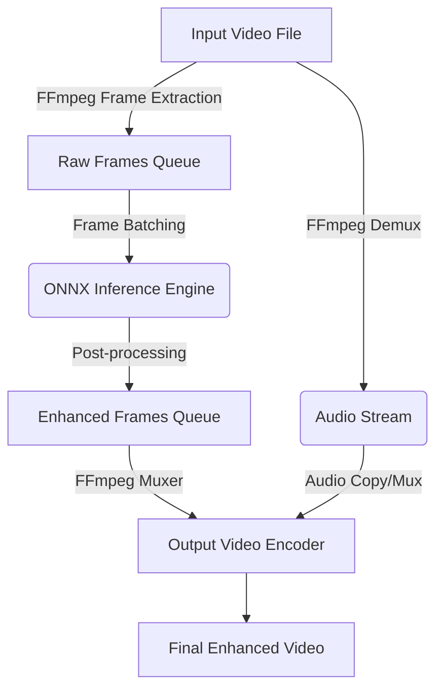

# Architecture Design

This document details the software architecture, modular structure, and data flow of `silukman_video_enhancer`.

---

## System Architecture

The application is structured into three primary decoupled layers:

```
┌─────────────────────────────────────────────────────────┐
│                      Interface Layer                    │
│        (Command Line / Python Desktop UI - PySide6)     │
└────────────────────────────┬────────────────────────────┘
                             │
                             ▼
┌─────────────────────────────────────────────────────────┐
│                      Pipeline Layer                     │
│    (Video Demuxer, Frame Buffer, Audio Extractor, Muxer) │
└────────────────────────────┬────────────────────────────┘
                             │
                             ▼
┌─────────────────────────────────────────────────────────┐
│                     Inference Layer                     │
│          (ONNX Runtime Core & Model Providers)          │
└─────────────────────────────────────────────────────────┘
```

1.  **Interface Layer**: Receives configuration arguments from the CLI or PySide6 desktop UI, manages input/output file paths, and reports processing progress (FPS, estimated time remaining, current frame index).
2.  **Pipeline Layer**: Handles physical file access, wraps FFmpeg processes to read/write video frames, and extracts/muxes audio tracks.
3.  **Inference Layer**: Manages the life cycle of neural network models, prepares image tensors, and runs hardware-accelerated processing via ONNX Runtime.

---

## Component Overview

### 1. Video Reader / Demuxer
Utilizes an FFmpeg subprocess to extract raw, uncompressed video frames (RGB24/BGR24) and push them into an in-memory queue. This prevents loading the entire video into RAM.

### 2. Processing Queue
A synchronized multi-threaded queue that interfaces between the video reader and the inference engine.

### 3. Inference Engine
Loads the selected model into ONNX Runtime (ORT). It automatically identifies hardware capabilities (e.g., CUDA, DirectML, CoreML) and sets up the appropriate Execution Provider.

### 4. Audio Extractor & Muxer
Uses FFmpeg to demux audio from the input file as a temporary asset, then muxes it back with the enhanced frames into the final output video container (e.g., MP4/MKV).

### 5. Non-blocking Progress Monitor
A dedicated monitoring thread that decoupledly queries queue lengths, hardware metrics (VRAM usage, GPU load, CPU temperature), current rendering speed (FPS), and progress bars using `rich` console dashboards without causing processing lock contention in the main pipeline.

---

## Data Flow Diagram

The sequence below outlines how a video is processed:



---

## Technology Stack

*   **Language**: Python 3.9+
*   **Desktop UI**: PySide6 / Qt (planned)
*   **Media I/O**: FFmpeg (via subprocess or bindings)
*   **Computer Vision**: OpenCV (for pre/post-processing array manipulations)
*   **Deep Learning Runtime**: ONNX Runtime (`onnxruntime` / `onnxruntime-gpu`)
*   **Hardware Backends**:
    *   **NVIDIA**: CUDA & TensorRT Execution Providers
    *   **Apple Silicon**: CoreML Execution Provider
    *   **Windows / AMD**: DirectML Execution Provider
    *   **Fallback**: CPU Execution Provider (multi-threaded OpenMP)
