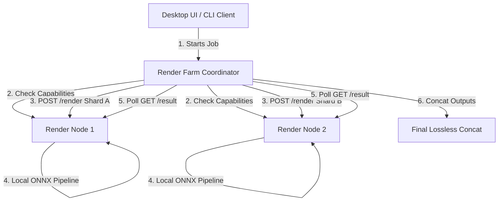

# LAN Render Farm & Distributed Processing Protocol

This document details the architecture, frame sharding strategies, and the HTTP communications protocol used by the Local Area Network (LAN) Render Farm in `silukman_video_enhancer`.

---

## 1. System Architecture Overview

To scale video enhancement throughput on local consumer hardware without using cloud computing, the application supports distributed processing across multiple rendering nodes in a local network.



*   **Render Farm Coordinator**: Manages the orchestration, sharding, segment planning, dispatch, and final concatenation of completed media assets.
*   **Render Node**: A lightweight service running on another device in the local network that accepts, executes, and reports the state of specific frame rendering and transcoding shards.

---

## 2. Communication Contract (HTTP API)

Render Nodes host a standard HTTP server implementing the following endpoints:

### GET `/health`
Returns the status of the node to verify readiness.
*   **Response (200 OK)**:
    ```json
    {
      "status": "ready",
      "name": "node-alpha"
    }
    ```

### GET `/capabilities`
Declares the hardware execution providers and maximum workers available on the node.
*   **Response (200 OK)**:
    ```json
    {
      "name": "node-alpha",
      "providers": ["CUDAExecutionProvider", "CPUExecutionProvider"],
      "max_workers": 2
    }
    ```

### POST `/render`
Submits a new frame processing or transcoding segment shard to the node queue.
*   **Request Body**:
    ```json
    {
      "job_id": "render-job-001",
      "start_frame": 0,
      "end_frame": 1000,
      "scale": 2,
      "model_name": "Real-ESRGAN"
    }
    ```
*   **Response (202 Accepted)**:
    ```json
    {
      "id": "render-job-001",
      "start_frame": 0,
      "end_frame": 1000,
      "status": "queued",
      "message": "accepted"
    }
    ```

### GET `/result/{job_id}`
Checks the current status, progress, or diagnostic logs of an active or completed job.
*   **Response (200 OK)**:
    ```json
    {
      "id": "render-job-001",
      "start_frame": 0,
      "end_frame": 1000,
      "status": "completed",
      "message": "success"
    }
    ```

### POST `/cancel/{job_id}`
Cancels execution of a running shard and cleans up its temporary folder resources.
*   **Response (200 OK)**:
    ```json
    {
      "id": "render-job-001",
      "start_frame": 0,
      "end_frame": 1000,
      "status": "cancelled",
      "message": "cancelled"
    }
    ```

---

## 3. Sharding & Transcoding Mechanics

The Render Farm utilizes two distribution patterns based on job types:

### A. Frame Sharding (Sequential Video Enhancement)
For video frame upscaling:
1.  **Split**: The coordinator divides total frames into equal chunks (`total_frames / active_nodes`).
2.  **Execution**: Nodes run their local pipeline on their allocated frame sequence.
3.  **Merge**: Once all nodes complete successfully, the coordinator executes an FFmpeg lossless `concat` merge:
    ```bash
    ffmpeg -y -f concat -safe 0 -i concat_list.txt -c copy output.mp4
    ```

### B. Distributed Transcoding
For duration-based compression/transcoding jobs:
1.  **Duration Split**: The coordinator splits duration by a configurable segment length (e.g., 30 seconds).
2.  **Adaptive Merge**: Nodes transcode their segment. If a single segment is output, it is processed directly. If multiple segments are output, they are merged losslessly via FFmpeg using `stream-copy` (no re-decoding).

---

## 4. Failure Recovery & Error Handling

*   **Retries**: If a node fails to complete a shard, the coordinator automatically retries the payload on the next available ready node.
*   **Checkpoint Resiliency**: Completed nodes cache rendered segments so that if another node fails, only the failed shard is re-scheduled, preserving completed rendering cycles.
