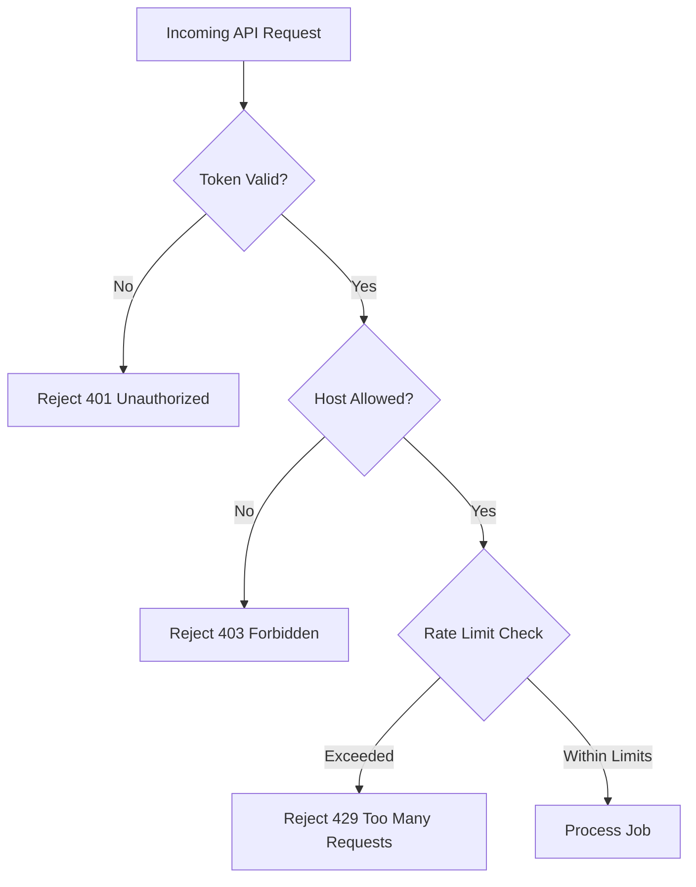

# Network Security & Access Controls

This document details the security layers, host filtering, rate limiting, and LAN isolation configurations in `silukman_video_enhancer`.

---

## 1. Overview & Purpose

Exposing execution endpoints over a Local Area Network (LAN) for distributed render farm or WebUI operations introduces security risks. Unauthorized clients could submit heavy rendering jobs or intercept video processing commands.

To protect host machines, the headless service mode implements localized, network-level security controls.

---

## 2. Access Control Policies

The service enforces three primary security controls:



### A. Bearer Token Authentication
*   Every request must include an access token in the headers.
*   Tokens are generated locally and stored securely on the host workstation.

### B. Allowed Hosts & Bind Configuration
*   **Localhost Only**: By default, servers bind to `127.0.0.1`, rejecting all external network connections.
*   **LAN Share**: If configured for LAN sharing, the server binds to the local interface (e.g. `192.168.1.50`) and restricts incoming IPs using a whitelist of allowed network subnets.

### C. Rate Limiting
*   Protects rendering coordinators from API denial-of-service attempts.
*   Limits requests per IP address per minute using a sliding-window counter.

---

## 3. LAN Render Farm Isolation

For distributed node topologies:
*   Nodes communicate via HTTP. They should be deployed only inside trusted, firewalled local networks.
*   Render nodes verify coordinator IPs before executing `/render` payloads.

---

## 4. Verification

The token auth checks, rate limiter counts, and host binding validations are verified in:

```bash
python3 -m unittest tests.test_phase6_completion
```
Unit tests check that unauthorized headers return `401` or `403` status codes.
