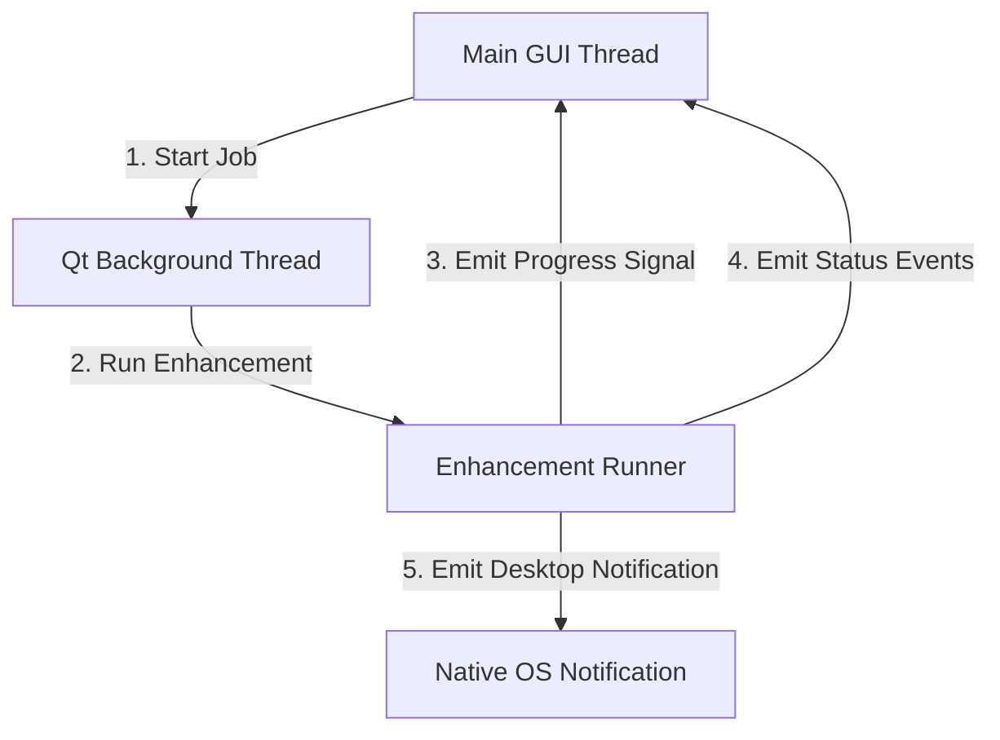

# Desktop UI Architecture & Components

This document details the PySide6/Qt desktop UI architecture, worker thread model, and visual components in `silukman_video_enhancer`.

---

## 1. Overview & Purpose

To provide a professional, user-friendly interface for local video upscaling and restoration, the application includes a Python desktop GUI built with **PySide6 (Qt for Python)**.

The UI architecture handles:
*   Non-blocking background thread execution.
*   Side-by-side video comparisons.
*   Timeline crop preview rendering.
*   Drag-and-drop file inputs.

---

## 2. Worker Thread Model

To prevent the GUI window from freezing during heavy AI enhancement, all pipeline tasks are decoupled from the main thread:



*   **GUI Thread**: Handles user interactions, window updates, and metrics displays.
*   **Worker Thread**: Launches the `run_enhancement` pipeline.
*   **Signals**: Communicates progress percentage, remaining time, and job status using Qt's thread-safe signal/slot mechanism.

---

## 3. Side-by-Side Comparator

The visual comparator (`ui/comparator.py`) allows users to compare original and enhanced videos:
*   **Split Slider**: A draggable slider splits the video window. Moving the slider dynamically clips the enhanced video over the original video.
*   **Sampled Preview Extractor**: Extracts specific frames using FFmpeg to display high-quality crop previews instantly, avoiding the need to process the entire video file.

---

## 4. Drag-and-Drop and Timeline Crop Preview

*   **Drag-and-Drop Edit**: Text edits and panels accept video files dragged from local filesystems, validating paths and deriving default output names automatically.
*   **Timeline Crop Preview**: Generates crop previews at evenly spaced timestamps along the timeline to give users a quick summary of the enhancement across different scenes.

---

## 5. Verification

The GUI thread safety models, comparator split slider variables, and drop edit paths are verified in:

```bash
python3 -m unittest tests.test_phase3_completion
```
Unit tests ensure that path derivation, worker thread signals, and comparator states operate correctly without blocking.
