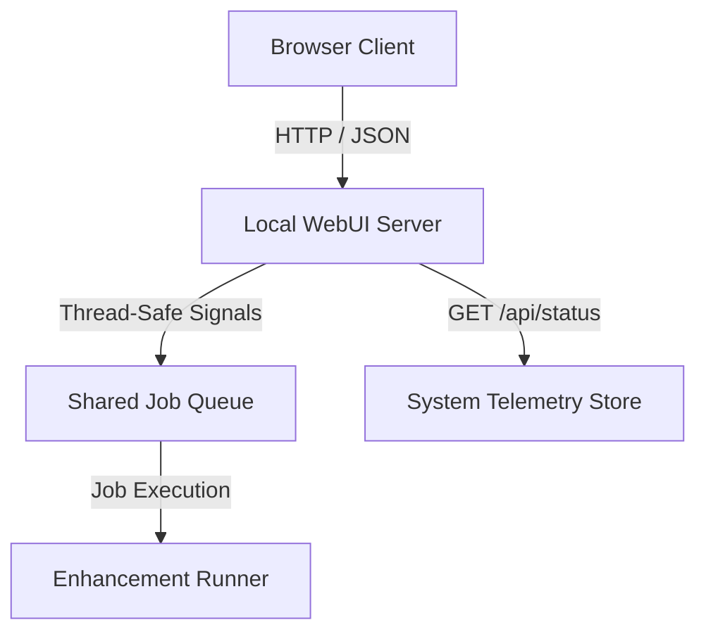

# Local WebUI & Job Submission Dashboard

This document details the architecture, routing schemas, and interface structures used by the Local WebUI and Job Submission Dashboard in `silukman_video_enhancer`.

---

## 1. Overview & Purpose

While the desktop GUI (PySide6) is ideal for single-workstation users, headless setups or shared network systems require a browser-accessible interface.

The **Local WebUI Dashboard** provides a lightweight, local web server allowing users to:
*   Inspect system status, hardware sensors, and execution logs.
*   Submit video enhancement jobs remotely to the local pipeline.
*   Manage, prioritize, and cancel items in the active job queue.

---

## 2. Server Architecture

The WebUI runs on a local web server (using FastAPI or Python's built-in Gunicorn-like servers) on the host machine:



*   **REST API Layer**: Receives commands from the browser and updates the central queue database.
*   **Asset Server**: Serves self-contained static HTML, CSS, and JS files, ensuring 100% offline accessibility without loading external assets or CDNs.

---

## 3. WebUI Endpoints

### `/`
Serves the main dashboard user interface displaying active jobs, speed metrics, thermal history, and the job submission form.

### `/api/status`
Returns real-time diagnostics of the host system:
*   **Response (200 OK)**:
    ```json
    {
      "host_name": "workstation-01",
      "cpu_load": 45.8,
      "gpu_temp": 72.0,
      "active_workers": 1,
      "queue_depth": 2
    }
    ```

### `/api/jobs`
Exposes queue submission and cancellation interfaces identical to the headless REST API endpoints.

---

## 4. Verification

The local WebUI host, status endpoints, and API mapping configurations are verified in the test suite:

```bash
python3 -m unittest tests.test_phase3_completion
python3 -m unittest tests.test_phase4_completion
```
Tests verify that the web dashboard binds to configured local ports and returns expected JSON structures.
