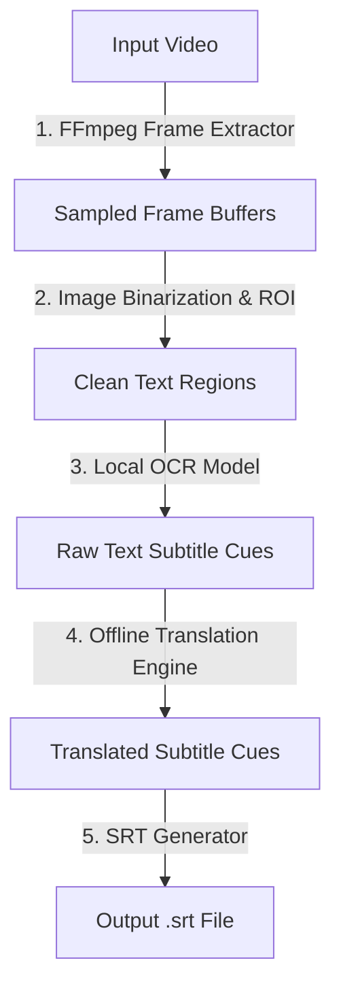

# Subtitle OCR and Translation Workflow

This document details the architecture, local processing stages, and file mapping protocols used by the Subtitle OCR and Translation pipeline in `silukman_video_enhancer`.

---

## 1. Overview & Purpose

Many local video archiving tasks require extracting hardcoded subtitles (burn-in text) from low-resolution files, converting them to text, and translating them into other languages. 

To support this offline-first requirement, the application implements a local subtitle extraction, OCR, and offline translation pipeline:



---

## 2. Processing Pipeline

The subtitle pipeline performs five core operations:

### A. Sampled Frame Extraction
Instead of analyzing every frame (which is computationally expensive), the engine uses FFmpeg to extract frames at regular intervals corresponding to the typical rate of subtitle changes:
```bash
ffmpeg -i input.mp4 -vf "fps=2" -pix_fmt rgb24 -f image2pipe -
```

### B. Local OCR Processing
The extracted frame buffers are processed locally:
1.  **Preprocessing**: Binarization and contrast adjustment are applied to separate white/yellow subtitle text from busy video backgrounds.
2.  **OCR Inference**: A local model parses the text characters.
3.  **Timestamp Mapping**: Frame numbers are converted back to timeline timestamps (`HH:MM:SS,mmm`).

### C. Offline Translation
For multilingual workflows, the text is routed through a local translation adapter:
*   Uses offline translation dictionaries or compressed translation models.
*   Translates text cues sentence-by-sentence.
*   Enforces zero network calls to maintain absolute privacy.

### D. SRT Generation
The final output is formatted into standard SubRip Subtitle (`.srt`) files containing numbered cues, timeline marks, and text payloads:
```text
1
00:00:01,500 --> 00:00:03,200
Hello, world!
```

---

## 3. Verification

The subtitle OCR and translation planners and executors are verified in the unit test suite:

```bash
python3 -m unittest tests.test_phase3_completion
python3 -m unittest tests.test_phase4_completion
```
