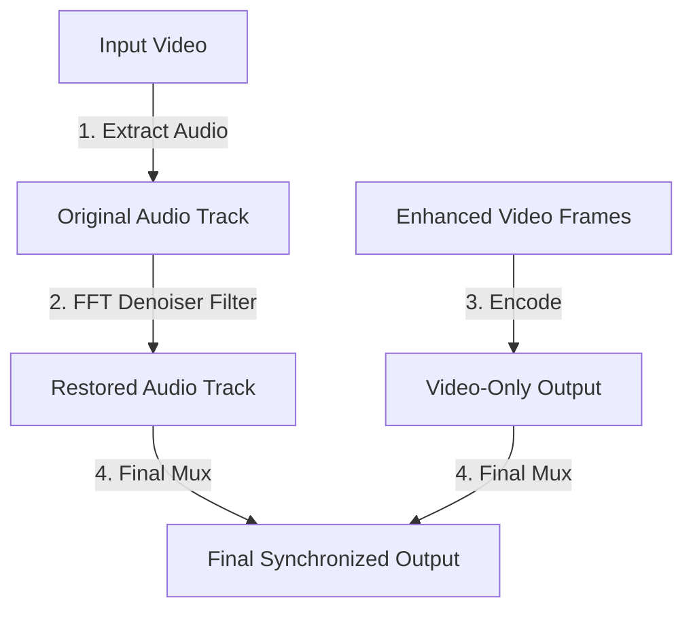

# Audio Restoration Pipeline & Muxing

This document explains the technical details of the audio extraction, FFT-based restoration, stream mapping, and re-muxing operations in `silukman_video_enhancer`.

---

## 1. Overview & Purpose

Preserving audio sync and quality is critical during AI video upscaling. Since frames are processed individually in an asynchronous loop, the audio track must be extracted beforehand, optionally cleaned of noise, and merged back into the final video file.

The decoupled audio restoration pipeline handles this process natively using FFmpeg subprocesses.

---

## 2. Pipeline Execution Steps



### Step 1: Audio Stream Extraction
The engine probes the source file for audio channels. If present, it writes the audio data to a temporary file, using stream copy to prevent quality loss:
```bash
ffmpeg -i input.mp4 -vn -c:a copy temp_audio.aac
```

### Step 2: Perceptual FFT Denoising
If the `--audio-restore` flag is enabled, the pipeline routes the extracted track through FFmpeg's **FFT-based Noise Reduction** filter (`afftdn`):
*   **Fourier Transform**: Converts the audio signal into the frequency domain.
*   **Noise Profiling**: Automatically isolates high-frequency hiss, fan noise, and background hum.
*   **Attenuation**: Reduces noise bands while maintaining original voice frequencies, exporting the cleaned audio.

### Step 3: Stream Re-Muxing
Once the video frames are fully enhanced and written, the coordinator merges the restored audio track and enhanced video track back into a unified container:
```bash
ffmpeg -y -i temp_enhanced.mp4 -i temp_restored_audio.aac -c:v copy -c:a copy -map 0:v:0 -map 1:a:0? final_output.mp4
```

---

## 3. Configuration & CLI Control

Audio restoration is managed via simple controls:
*   `--audio-restore`: Toggles the FFT denoiser filter.
*   `--no-audio`: Bypasses all extraction and outputs a silent video.

---

## 4. Verification

The commands constructed for audio extraction, noise filtering, and muxing are verified in:

```bash
python3 -m unittest tests.test_phase1_completion
```
Tests ensure that stream map parameters (`-map 0:v:0 -map 1:a:0?`) are formatted correctly and that missing audio streams are handled gracefully.
