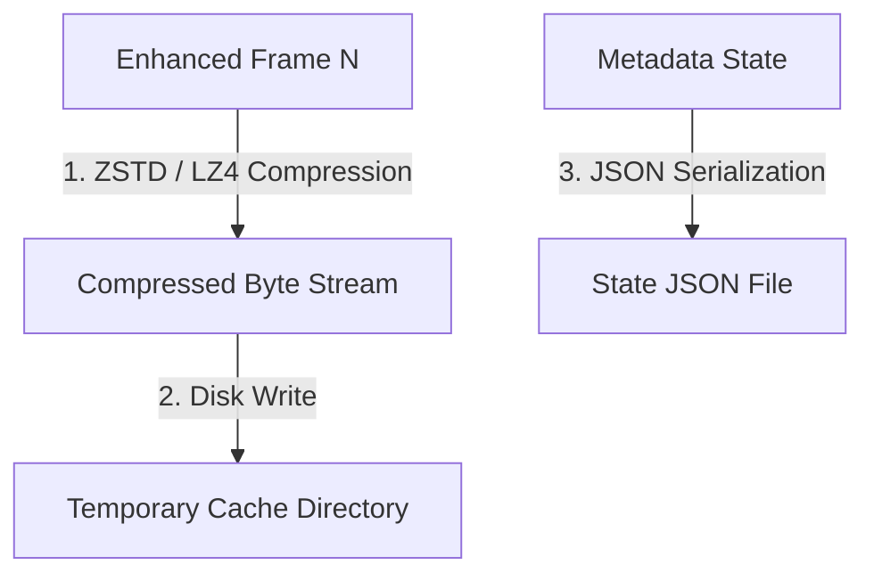

# Pause and Resume Checkpoint System

This document details the design, state formatting, and caching strategies used by the Pause and Resume Checkpoint System in `silukman_video_enhancer`.

---

## 1. Overview & Purpose

Video enhancement is a high-latency process that can take hours or even days to complete for full-length feature films. In case of power outages, system restarts, or manual cancellations, losing all completed render progress is unacceptable.

The **Pause and Resume Checkpoint System** allows the pipeline to save its progress at regular intervals and resume work from the last processed frame without discarding previously generated assets.

---

## 2. Checkpoint Caching Mechanics

To maximize efficiency and minimize local disk usage, the system avoids caching raw frame arrays. Instead, it utilizes high-speed lossless compression:



*   **Compression**: Staged frames are compressed using **ZSTD** or **LZ4** compression algorithms. This reduces the disk space required for frame caching by up to 80%.
*   **Directory Structure**: Cached frames are stored in a hidden local directory (`.tmp_frames/` or a user-specified `checkpoint_dir`).
*   **State Tracking File**: A JSON file (`checkpoint.json`) is maintained alongside the frames.

---

## 3. State JSON Schema

The checkpoint tracker stores the exact parameters required to restore the enhancement context:

```json
{
  "last_processed_frame_index": 2450,
  "config": {
    "model": "realesrgan",
    "scale": 2,
    "crf": 18,
    "fp16": true
  },
  "source_file_fingerprint": "a4f89d31...",
  "timestamp": "2026-06-02T14:20:00Z"
}
```

---

## 4. Recovery and Resume Flow

When a job starts:
1.  **Check**: The runner scans the designated `checkpoint_dir` for a valid `checkpoint.json` matching the source file fingerprint.
2.  **Restore**: If found, it loads the state, skips the first $N$ frames of the input stream, and initializes the pipeline at frame $N+1$.
3.  **Finalization**: When all frames are completed, the compressed cached frames are read, decompressed, piped to FFmpeg, and compiled into the final container. The checkpoint files are then deleted.

---

## 5. Verification

The checkpoint state validation, saving, and restoration workflows are verified in:

```bash
python3 -m unittest tests.test_phase2_task2
```
Specifically, the test suite verifies that the ZSTD/LZ4 cache correctly round-trips frame bytes and that the pipeline can resume processing from intermediate indices.
