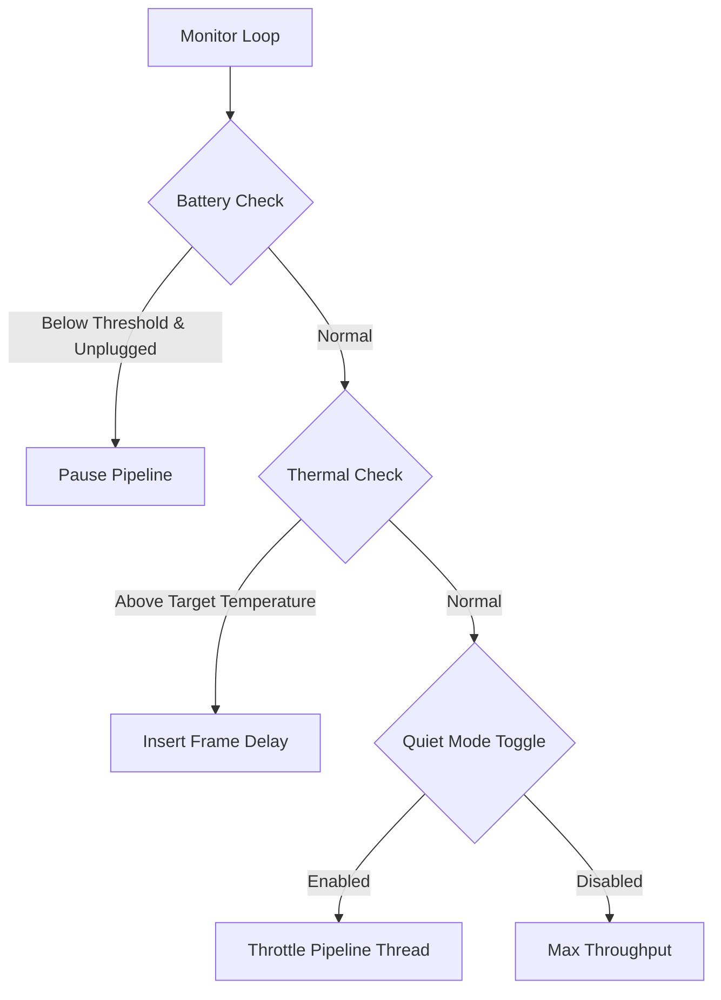

# Hardware & Thermal Governor

This document explains the dynamic resource control, battery preservation, and thermal safety systems implemented in `silukman_video_enhancer`.

---

## 1. Overview & Purpose

Deep learning video upscaling and frame enhancement are CPU and GPU intensive operations. On consumer hardware (especially thin laptops), prolonged runs can cause:
*   Critical overheating (thermal throttling or emergency shutdowns).
*   Heavy OS lag and interface stuttering.
*   Rapid battery drain when unplugged.

The **Hardware & Thermal Governor** dynamically monitors system metrics and adjusts pipeline execution speeds to protect hardware and maintain system usability.

---

## 2. Throttling and Control Loops

The governor implements three safety layers inside the main frame loop:



### A. Battery Safety Governor
*   **Trigger**: If the workstation is running on battery power and the charge drops below a configurable threshold (e.g., 20%).
*   **Action**: Automatically pauses the active job to prevent total system shutdown and loss of unsaved state.

### B. Thermal Governor
*   **Trigger**: Real-time CPU/GPU temperature sensors exceed target limits (e.g., 85°C).
*   **Action**: Introduces dynamic sleep delays (millisecond-scale) between frame inferences. This lowers core usage enough to let fans cool the hardware.

### C. Quiet / Background Mode
*   **Trigger**: CLI argument `--quiet` or UI setting toggle.
*   **Action**: Pin-throttles processing threads, yielding scheduling priorities to other OS windows so the user can continue working.

---

## 3. Configuration Parameters

The governor parameters are read from the global configurations:
*   `--quiet`: Enables quiet mode, reducing thread priorities.
*   `thermal_threshold`: Target temperature in Celsius (defaults to 80°C).
*   `low_battery_threshold`: Percentage minimum to allow running on battery.

---

## 4. Verification

The dynamic throttling calculation and battery check planning are covered by unit tests:

```bash
python3 -m unittest tests.test_phase3_completion
```
Tests assert that the governor correctly calculates thermal delays and initiates pauses based on mock telemetry.
